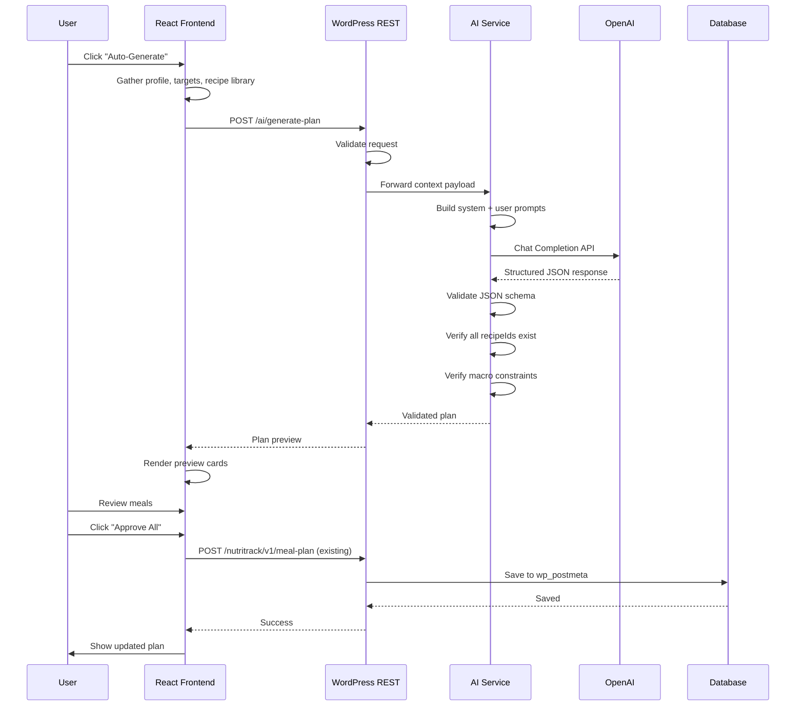
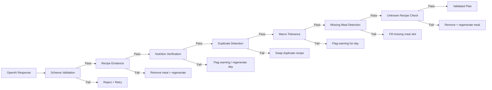
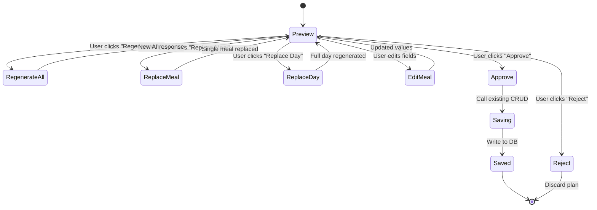

# AI Meal Engine

> Architecture and design for AI-powered meal plan generation in Nutritrack.
> This document must be read and approved before any implementation begins.

---

## 1. Vision

### Purpose
Eliminate the manual effort of building weekly meal plans by generating nutritionally complete, personalized meal plans via AI, while keeping the user in full control before any data is saved.

### Scope
- Generate a full week (7 days, 3–5 meals per day) of meal suggestions based on the user's profile, nutrition targets, and available recipe library.
- Provide structured, validated JSON that maps exclusively to known recipe IDs.
- Deliver the result through a review-then-approve UI cycle.
- Existing CRUD endpoints remain the sole writers to the database — the AI engine is read-only with respect to stored data.

### Goals
1. Reduce meal plan creation time from minutes to seconds.
2. Guarantee every suggested meal maps to a real, user-accessible recipe.
3. Meet macro targets within configurable tolerance (±10% per macro).
4. Respect all dietary preferences, allergies, and cuisine restrictions.
5. Provide provenance (confidence scores, reasoning) for AI decisions.
6. Operate cost-effectively under typical usage patterns.

### Non-goals
- AI directly writing to the WordPress database.
- Generating new recipes or modifying existing ones.
- Replacing the existing manual meal planner UI.
- Real-time streaming of AI responses.
- Image generation.
- Natural language meal search.

---

## 2. Architecture

### High-Level Architecture

```mermaid
graph TB
    subgraph React_Frontend
        A[MealPlannerPage] --> B[AIEnginePanel]
        B --> C[MealPreviewCard]
        B --> D[DayReviewPanel]
        D --> E[ApproveButton]
        D --> F[RegenerateButton]
        D --> G[EditMealButton]
    end

    subgraph WordPress_REST
        H[/wp-json/nutritrack/v1/meal-plan] --> I[REST Controller]
        J[/wp-json/nutritrack/v1/ai/generate-plan] --> K[AI Proxy Handler]
        K --> L[Validate Request]
        K --> M[Forward to AI Service]
        K --> N[Validate Response]
        K --> O[Return to Frontend]
    end

    subgraph AI_Service
        P[FastAPI Server] --> Q[Prompt Builder]
        Q --> R[OpenAI Chat Completion]
        R --> S[Response Parser]
        S --> T[Structured JSON Output]
    end

    subgraph Data_Layer
        U[(MySQL - Recipes)]
        V[(MySQL - Meal Plans)]
        W[(MySQL - User Profiles)]
    end

    A --> H
    B --> J
    I --> V
    K --> W
    K --> U
    P --> U
    E --> H
    G --> H

    style K fill:#f96,stroke:#333,stroke-width:2px
    style P fill:#6af,stroke:#333,stroke-width:2px
    style N fill:#9f9,stroke:#333,stroke-width:1px
```

### React Responsibilities
- Collect user context (profile, targets, preferences) and send to the AI endpoint.
- Render the AI-generated plan in a preview-only UI.
- Allow per-meal, per-day, and full-plan regeneration.
- Allow manual edits to any meal in the preview.
- On user approval, persist the plan by calling the existing Meal Planner CRUD endpoints.
- Never expose raw AI JSON to the user directly — always render through MealPreviewCard.

### WordPress Responsibilities
- Expose a new REST route: `POST /wp-json/nutritrack/v1/ai/generate-plan`.
- Validate the incoming request (user authentication, profile completeness, recipe library non-empty).
- Assemble the user context payload (omit AI service concerns like prompt engineering).
- Forward the request to the AI service via HTTP.
- Validate the AI response before returning it to the frontend.
- Log all AI interactions for audit and debugging.
- The AI Proxy Handler must never persist the AI response to the database.

### AI Service Responsibilities (FastAPI + OpenAI)
- Accept a structured JSON payload containing user profile, nutrition targets, and recipe library.
- Construct the system and user prompts with zero templating errors.
- Call OpenAI Chat Completion API (model: `gpt-4o-mini` or `gpt-4o`).
- Parse the AI response and return a validated, structured JSON.
- Reject and retry if the AI response is invalid JSON or violates the schema.
- Enforce token limits to control cost.
- Log every request/response pair for debugging.

---

## 3. End-to-End Workflow



### Step-by-Step

1. **User triggers** — Clicks "Auto-Generate" on MealPlannerPage.
2. **Frontend gathers** — Reads user profile from React context/query, nutrition targets from TDEEInfo, available recipes from recipe library store.
3. **Frontend sends** — POST to `/wp-json/nutritrack/v1/ai/generate-plan` with structured payload.
4. **WordPress validates** — Checks JWT validity, user profile completeness, recipe library non-empty.
5. **WordPress forwards** — Sends enriched context to AI service (host, port, and API key configured in wp-config.php or plugin settings).
6. **AI service prompts** — Builds system prompt (role, constraints, output format) and user prompt (profile, targets, recipe library).
7. **OpenAI generates** — Returns structured JSON with meals, macros, and confidence.
8. **AI service validates** — Schema check → recipe existence check → macro tolerance check.
9. **AI service responds** — Returns validated JSON to WordPress.
10. **WordPress validates** — Second-layer validation (defense in depth).
11. **WordPress responds** — Returns validated plan to frontend.
12. **Frontend renders** — Displays preview using MealPreviewCard components.
13. **User reviews** — Regenerates, replaces, edits, or approves.
14. **User approves** — Frontend calls existing CRUD endpoints to persist.
15. **Plan saved** — User sees the final plan in the standard Meal Planner view.

---

## 4. Prompt Design

### System Prompt

```
You are NutritrackAI, a meal planning assistant. Your only task is to generate
weekly meal plans using recipes from a provided library. You MUST follow these
rules:

1. ONLY use recipe IDs from the provided recipe library. Never invent recipes.
2. Return ONLY valid JSON. No explanations, no markdown, no code fences.
3. Each day must have exactly {mealsPerDay} meals: breakfast, lunch, dinner,
   and optionally snack.
4. Meet the user's macro targets within {macroTolerance}% tolerance per macro.
5. Respect the user's dietary restrictions, allergies, and cuisine preferences.
6. Vary recipes across days — avoid repeating the same recipe within 3 days.
7. Each meal entry MUST include a recipeId that exists in the provided library.
8. For optional fields like `reasoning`, keep it under 50 words.
9. Confidence is a float 0.0–1.0. High confidence (>=0.9) means the meal
   perfectly matches targets. Low confidence (<0.7) means compromises were made.
10. Warnings are human-readable strings that explain any trade-offs, e.g.
    "This meal slightly exceeds the fat target for the day."
```

### User Prompt Template

```
Generate a 7-day meal plan for the following user.

USER PROFILE:
- Age: {age}
- Gender: {gender}
- Height: {heightCm} cm
- Weight: {weightKg} kg
- Activity Level: {activityLevel}
- Goal: {goal}
- Diet: {diet}
- Allergies: {allergies}
- Preferred Cuisine: {cuisine}
- Cooking Skill: {cookingSkill}

NUTRITION TARGETS (Daily):
- Calories: {targetCalories} kcal
- Protein: {proteinGrams}g
- Carbs: {carbsGrams}g
- Fats: {fatsGrams}g

AVAILABLE RECIPES (id: name — macros per serving):
{recipeLibrary}

Generate exactly {mealsPerDay} meals per day for 7 days.
```

### Constraints Summary

| Constraint | Enforcement |
|---|---|
| Only known recipe IDs | Prompt instruction + post-validation |
| JSON-only output | Prompt instruction + schema validation |
| Macro tolerance (±10%) | Prompt instruction + post-validation |
| Dietary/allergy restrictions | Prompt instruction + recipe library filtering before prompt |
| Cuisine preference | Prompt instruction |
| No recipe repetition within 3 days | Prompt instruction + post-validation |

### Token Optimization

| Technique | Estimated Savings |
|---|---|
| Send `id: name — P/C/F per serving` instead of full recipe text | ~60% reduction |
| Omit recipe instructions, ingredients, images | ~30% reduction |
| Short system prompt (under 500 tokens) | — |
| Limit `reasoning` to 50 words | ~10% reduction |
| Use `gpt-4o-mini` for generation | ~95% cost reduction vs `gpt-4o` |

Typical request size: ~2,000–3,500 tokens (with 150 recipes in library).
Typical response size: ~1,000–2,000 tokens.

---

## 5. Request Schema

```json
{
  "userId": 42,
  "profile": {
    "age": 30,
    "gender": "male",
    "heightCm": 178,
    "weightKg": 82,
    "activityLevel": "moderately-active",
    "goal": "lose-weight",
    "diet": "none",
    "allergies": ["peanuts", "seafood"],
    "cuisine": "mediterranean",
    "cookingSkill": "intermediate"
  },
  "targets": {
    "calories": 2200,
    "proteinGrams": 165,
    "carbsGrams": 220,
    "fatsGrams": 73
  },
  "config": {
    "days": 7,
    "mealsPerDay": 4,
    "macroTolerance": 0.1,
    "maxRecipeRepeatDays": 3,
    "cuisineStrict": false
  },
  "recipes": [
    {
      "recipeId": 101,
      "name": "Grilled Chicken Salad",
      "servings": 1,
      "calories": 450,
      "proteinGrams": 40,
      "carbsGrams": 15,
      "fatsGrams": 22
    }
  ]
}
```

### Field Descriptions

| Field | Type | Description |
|---|---|---|
| `userId` | int | WordPress user ID |
| `profile` | object | User demographic and preference data |
| `targets` | object | Daily macro targets from TDEE calculation |
| `config` | object | Generation parameters |
| `recipes` | array | Available recipes (compressed: macro per serving only) |
| `recipes[].recipeId` | int | WordPress post ID of the recipe |
| `recipes[].name` | string | Short name for prompt context |
| `recipes[].servings` | int | Default servings for the recipe |
| `recipes[].calories` | int | Calories per serving |
| `recipes[].proteinGrams` | float | Protein per serving |
| `recipes[].carbsGrams` | float | Carbs per serving |
| `recipes[].fatsGrams` | float | Fats per serving |

---

## 6. Response Schema

```json
{
  "planId": null,
  "generatedAt": "2026-01-15T10:30:00Z",
  "model": "gpt-4o-mini",
  "days": [
    {
      "date": "2026-01-20",
      "dayOfWeek": "Monday",
      "meals": [
        {
          "mealId": null,
          "mealType": "breakfast",
          "recipeId": 101,
          "recipeName": "Grilled Chicken Salad",
          "servings": 1,
          "calories": 450,
          "proteinGrams": 40,
          "carbsGrams": 15,
          "fatsGrams": 22,
          "confidence": 0.95,
          "reasoning": "High-protein breakfast meets daily protein target.",
          "warnings": []
        }
      ],
      "dayTotals": {
        "calories": 2100,
        "proteinGrams": 160,
        "carbsGrams": 210,
        "fatsGrams": 70
      },
      "confidence": 0.92,
      "warnings": [
        "Carbs are 5% below target — within tolerance."
      ]
    }
  ],
  "overallConfidence": 0.91,
  "warnings": [
    "No seafood recipes available — allergy respected."
  ]
}
```

### Field Descriptions

| Field | Type | Description |
|---|---|---|
| `planId` | null\|int | Always `null` from AI (assigned on save) |
| `generatedAt` | string (ISO 8601) | Timestamp of generation |
| `model` | string | OpenAI model used |
| `days` | array | 7 day objects |
| `days[].date` | string | ISO date for this day |
| `days[].dayOfWeek` | string | Human-readable day name |
| `days[].meals` | array | 3–5 meal objects per day |
| `days[].meals[].mealId` | null\|int | Always `null` from AI |
| `days[].meals[].mealType` | string | `breakfast`, `lunch`, `dinner`, `snack` |
| `days[].meals[].recipeId` | int | Must match a recipe in the provided library |
| `days[].meals[].recipeName` | string | Recipe name for display |
| `days[].meals[].servings` | int | Number of servings |
| `days[].meals[].calories` | int | Calories for this meal instance |
| `days[].meals[].proteinGrams` | float | Protein for this meal instance |
| `days[].meals[].carbsGrams` | float | Carbs for this meal instance |
| `days[].meals[].fatsGrams` | float | Fats for this meal instance |
| `days[].meals[].confidence` | float | 0.0–1.0 confidence for this meal |
| `days[].meals[].reasoning` | string\|null | Optional explanation (max 50 words) |
| `days[].meals[].warnings` | array | Zero or more warning strings |
| `days[].dayTotals` | object | Aggregated macros for the day |
| `days[].confidence` | float | Overall confidence for the day |
| `days[].warnings` | array | Day-level warnings |
| `overallConfidence` | float | Plan-level confidence |
| `warnings` | array | Plan-level warnings |

---

## 7. Validation Pipeline

Validation is applied in two layers: AI Service (immediately after OpenAI response) and WordPress (before returning to frontend).



### Stage 1: Schema Validation
- Confirm the response is valid JSON.
- Confirm all required top-level keys exist: `days`, `generatedAt`, `overallConfidence`.
- Confirm each day has `date`, `meals`, `dayTotals`.
- Confirm each meal has `mealType`, `recipeId`, `servings`, `calories`, `proteinGrams`, `carbsGrams`, `fatsGrams`.
- Confirm `mealType` is one of `breakfast`, `lunch`, `dinner`, `snack`.
- Confirm `confidence` is a float 0.0–1.0.
- **Failure action**: Retry the OpenAI call (max 2 retries). If all retries fail, return an error to the user.

### Stage 2: Recipe Existence
- For every `recipeId` in the response, verify it exists in the provided recipe library.
- **Failure action**: Remove the offending meal and ask the AI to regenerate only that meal slot. If this happens >3 times, return an error.

### Stage 3: Nutrition Verification
- Confirm `calories` = `servings` × (recipe calories per serving) within ±5%.
- Confirm `proteinGrams` = `servings` × (recipe protein per serving) within ±5%.
- Confirm the same for `carbsGrams` and `fatsGrams`.
- **Failure action**: Flag a warning and correct the values server-side. Log the discrepancy for analysis.

### Stage 4: Duplicate Detection
- Check that the same `recipeId` does not appear more than once within a 3-day rolling window.
- **Failure action**: Replace the duplicate meal with a different recipe from the library. If no suitable replacement exists, flag a warning.

### Stage 5: Macro Tolerance
- Compare each day's `dayTotals` against the user's daily targets.
- Tolerance: ±10% per macro by default (configurable via `config.macroTolerance`).
- **Failure action**: Flag a day-level warning. If >20% deviation, regenerate the entire day.

### Stage 6: Missing Meal Detection
- Confirm each day has exactly `mealsPerDay` meals.
- Confirm meal types cover the required slots (breakfast, lunch, dinner).
- **Failure action**: Fill the missing slot with a random appropriate recipe from the library. Flag a warning.

### Stage 7: Unknown Recipe Check
- Verify no `recipeId` is 0, null, or negative.
- Verify no recipe name appears that doesn't match a library entry.
- **Failure action**: Remove the invalid meal entry and regenerate.

---

## 8. Review Before Save

The AI engine is a suggestion system. It must never directly write to the database.



### User Actions Available During Review

| Action | Behavior |
|---|---|
| **Regenerate All** | Re-call the AI endpoint with the same parameters. Entire preview is replaced. |
| **Replace One Meal** | Call AI endpoint with a modified request targeting only the specific day + meal slot. |
| **Replace One Day** | Call AI endpoint with a modified request targeting only the specific day. |
| **Edit Manually** | Allow the user to change `recipeId`, `servings`, or `mealType` directly in the preview UI. These changes are local until approval. |
| **Approve** | Frontend iterates over the validated plan and calls existing CRUD endpoints for each day. The existing `POST create_plan_meal` and related endpoints are the source of truth. |
| **Reject** | Discard the preview entirely. No data is written. |

### Enforcement Rules
1. The WordPress AI Proxy Handler must never call `wp_insert_post`, `update_post_meta`, or any write function.
2. The AI Service must have no database credentials — it cannot write even if compromised.
3. The React preview state is ephemeral — refreshing the page before approval discards the plan.
4. Approval always goes through the existing, tested CRUD flow.

---

## 9. Security

### JWT Authentication
- All `/ai/generate-plan` requests require a valid JWT token.
- Token validation uses the same `Nutritrack_Helpers::permission_callback` as all other endpoints.
- Token must include user ID — the AI service uses this for logging, not authorization (authorization happens at WordPress level).

### API Keys
- WordPress to AI Service communication uses a shared API key stored in `wp-config.php` (defined constant, not in the database).
- AI Service to OpenAI uses a server-side environment variable (`OPENAI_API_KEY`).
- API keys are never exposed to the frontend.
- API keys are never logged in plaintext.

### Prompt Injection Protection
- User profile fields (age, gender, diet) are validated and sanitized before being included in prompts.
- Free-text fields (if any future ones exist) are stripped of control characters and truncated.
- The `recipeLibrary` is assembled server-side from database records — user input cannot inject content into it.
- AI Service applies input sanitization as a second layer.

### Rate Limiting
- Maximum 5 generation requests per user per hour (configurable).
- Maximum 10 replacement requests per user per hour.
- Rate limits are enforced at the WordPress level using user meta timestamps.
- Error responses include `Retry-After` header.

### Logging
- WordPress logs: user ID, request timestamp, model used, token count, success/failure, warning count.
- AI Service logs: request hash (not full request), response hash, validation results, latency.
- Logs are retained for 30 days, then automatically purged.
- Logs never contain JWTs, API keys, or plaintext passwords.

### PII Handling
- User name and email are never sent to the AI Service or OpenAI.
- The profile payload sent to OpenAI contains only age, gender, height, weight, activity level, goal, diet, allergies, cuisine, and cooking skill — none of which alone identifies a specific person.
- Height and weight are communicated as integers, not as precise measurements.
- No session tokens, cookies, or IP addresses are forwarded to OpenAI.
- Users must be informed via a privacy notice that anonymized profile data is sent to OpenAI for meal generation.

---

## 10. Cost Optimization

### Caching
- **Recipe library cache**: The recipe library is cached in WordPress transients (TTL: 1 hour). Multiple generation requests within the same hour reuse the cached library.
- **Response cache**: Identical generation requests (same profile + same targets + same recipe library hash) within a 5-minute window return a cached result. Cache key is `ai_plan_{md5_hash}`.
- **Profile cache**: User profiles are already cached via React Query. The AI Service additionally caches profile data for 5 minutes.

### Recipe Compression
- Only send `recipeId`, `name`, and macros per serving (4 numeric fields).
- Omit: ingredients list, cooking instructions, image URLs, prep time, cook time, difficulty, tags, and description.
- Typical recipe entry: ~80 bytes instead of ~2 KB.
- 150 recipes ≈ 12 KB instead of ~300 KB.

### Prompt Compression
- System prompt is static (can be cached by the AI Service).
- Recipe library is the largest variable component — compression described above.
- User profile is small and fixed-size (~200 bytes).

### Batching
- The `/ai/generate-plan` endpoint generates all 7 days in a single OpenAI call.
- This is far more efficient than 7 separate calls (one system prompt + one large response).
- If token limits are hit, fall back to generating 3–4 days per call (2 calls total).

### Model Selection

| Model | Cost per 1K input tokens | Cost per 1K output tokens | Typical request cost | When to use |
|---|---|---|---|---|
| `gpt-4o-mini` | $0.00015 | $0.00060 | ~$0.002 | Default — all generation requests |
| `gpt-4o` | $0.00250 | $0.01000 | ~$0.035 | Only when `gpt-4o-mini` fails validation >3 times |

Estimated cost per user per generation: **$0.002** (gpt-4o-mini) / **$0.035** (gpt-4o fallback).

---

## 11. Failure Handling

| Failure Mode | Detection | User Experience | Recovery |
|---|---|---|---|
| **Timeout** | AI Service sets 30s timeout on OpenAI call | "Generation timed out. Try again." | Retry with `gpt-4o-mini` (faster). If still timeout, suggest manual plan. |
| **Invalid JSON** | Schema validation fails | "AI returned an invalid response. Regenerating..." | Automatic retry (max 2). On 3rd failure, return error. |
| **Unknown recipe** | Recipe existence check fails | Specific meal shows "Unknown recipe — replaced" | Remove meal and replace with a random valid recipe. |
| **Nutrition mismatch** | Nutrition verification fails | Meal shows corrected macros with warning icon | Correct values server-side. Log discrepancy. |
| **Hallucinated recipe** | `recipeId` not in library | Meal marked "Unavailable recipe" | Replace with a random valid recipe from the library. |
| **AI unavailable** | OpenAI API returns 5xx or connection error | "AI service is temporarily unavailable. Please try again later." | No retry. Log error. Notify admin if repeated. |
| **Rate limited** | WordPress rate limit check | "You've reached the maximum number of generations. Try again in {X} minutes." | Show remaining cooldown time. |
| **Empty recipe library** | Request validation | "No recipes found. Add recipes before generating a plan." | Guide user to recipe creation flow. |
| **Incomplete profile** | Request validation | "Complete your profile and nutrition targets before generating." | Link to onboarding/settings page. |

### Retry Strategy

```
OpenAI call → timeout or error?
  └─ Yes → retry #1 (wait 1s)
     └─ Yes → retry #2 (wait 2s)
        └─ Yes → return error to user

Schema validation fails?
  └─ Yes → retry #1 with "Previous response was invalid JSON. Return ONLY valid JSON."
     └─ Yes → retry #2 with stricter prompt
        └─ Yes → return error to user

Recipe existence fails (<3 meals)?
  └─ Replace with random matching recipe from library, flag warning

Recipe existence fails (>=3 meals)?
  └─ Retry the entire plan generation
```

---

## 12. Future Features

### Grocery Generation
- Collect all recipe ingredients across the approved 7-day plan.
- Deduplicate by ingredient.
- Group by grocery category (produce, dairy, meat, pantry).
- Output as a structured shopping list.
- API endpoint: `POST /wp-json/nutritrack/v1/ai/generate-grocery-list`.

### Meal Swap
- Allow the user to swap a specific meal for any other recipe in the library.
- AI suggests 3 alternative meals that fit the remaining macro budget for the day.
- User picks one, and the day is automatically rebalanced.
- No full regeneration needed.

### Weekly Coaching
- After each approved plan, AI generates a weekly summary with tips:
  - "You're getting enough protein, but consider adding more fiber."
  - "Try meal-prepping the chicken dishes on Sunday to save time."
- Shown as a dismissible card on the dashboard.

### Adaptive Meal Plans
- After the user completes a week, analyze which meals were logged vs skipped.
- Future generations deprioritize skipped meals and prioritize logged ones.
- Learning signal: `{ userId, recipeId, completed: boolean }` per meal.

### Budget Optimization
- Add `costPerServing` to recipe entries.
- AI optimizes meal selection to stay within a daily/weekly budget.
- Trade-off: highest nutrition per dollar.

### Seasonal Recipes
- Add `season` tag to recipes (spring, summer, fall, winter, all).
- AI only selects recipes that match the current season.
- Rotates meal variety naturally throughout the year.

---

## 13. Sprint Roadmap

### Sprint 9B — Backend AI Endpoint
- Create FastAPI project scaffold.
- Implement request schema validation (Pydantic).
- Build prompt builder module.
- Implement OpenAI integration with retry logic.
- Implement response validation pipeline.
- Add logging and error handling.
- Add rate limiting middleware.
- WordPress: create `/ai/generate-plan` REST route (proxy handler).
- WordPress: add AI service configuration (host, port, API key).
- WordPress: add rate limiting via user meta.
- **Deliverable**: Working `POST /ai/generate-plan` endpoint end-to-end.

### Sprint 9C — React Preview UI
- Create `AIEnginePanel` component (container for AI generation).
- Create `MealPreviewCard` component (single meal in preview).
- Create `DayReviewPanel` component (full day with actions).
- Create `AIPreviewToolbar` (Regenerate All, Approve, Reject buttons).
- Wire "Auto-Generate" button in MealPlannerPage to `AIEnginePanel`.
- Add React Query mutation for `/ai/generate-plan`.
- Add loading, empty, error states for the AI flow.
- **Deliverable**: User can generate and view an AI plan in preview.

### Sprint 9D — Approval + Save
- Implement "Approve" flow: iterate over preview, call existing CRUD per day.
- Implement "Reject" flow: discard preview, return to empty planner.
- Implement "Regenerate All" flow.
- Implement "Replace Day" flow.
- Implement "Replace Meal" flow.
- Implement manual edit within preview.
- Add confirmation dialogs for Approve and Reject.
- Add toast notifications for success/failure.
- **Deliverable**: Full review-before-save cycle end-to-end.

### Sprint 9E — Meal Swap
- Create "Swap Meal" modal showing 3 AI-suggested alternatives.
- Create `POST /ai/suggest-swap` endpoint.
- Implement macro rebalancing after swap.
- Wire swap confirmation to existing update meal endpoint.
- **Deliverable**: User can swap a meal for an AI-suggested alternative.

### Sprint 9F — Grocery Generation
- Create `POST /ai/generate-grocery-list` endpoint.
- Create `GroceryListPanel` component.
- Group ingredients by category.
- Add checkbox for purchased items.
- Add print-friendly view.
- **Deliverable**: User can generate and view a grocery list from their approved plan.

---

## 14. Acceptance Criteria

### Definition of Done for Sprint 9B

- [ ] FastAPI server starts and responds to health check at `/health`.
- [ ] `POST /generate` accepts the Request Schema and returns the Response Schema.
- [ ] Schema validation rejects invalid requests with descriptive error messages.
- [ ] Recipe existence validation catches hallucinated recipes.
- [ ] Nutrition verification corrects minor macro discrepancies.
- [ ] Rate limiting blocks requests beyond the configured limit.
- [ ] All errors are logged with correlation IDs.
- [ ] WordPress proxy endpoint authenticates via JWT.
- [ ] WordPress proxy endpoint validates user profile completeness.
- [ ] WordPress proxy endpoint never writes to the database.
- [ ] Configuration (API keys, host, port) is externalized to environment variables.
- [ ] Test coverage: >=80% for validation pipeline, >=60% for integration.

### Definition of Done for Sprint 9C

- [ ] "Auto-Generate" button triggers the AI flow.
- [ ] Loading state shows a skeleton or spinner during generation.
- [ ] Error state shows actionable error messages.
- [ ] Empty state appears when no plan has been generated.
- [ ] AI plan renders as 7 day columns with meal cards.
- [ ] Each meal card shows: meal type, recipe name, servings, macros.
- [ ] Each meal card shows confidence score and warnings.
- [ ] User can scroll through all 7 days.
- [ ] All TypeScript strict mode checks pass.
- [ ] No CSS regressions in existing Meal Planner UI.
- [ ] Unit tests for `AIEnginePanel`, `MealPreviewCard`, `DayReviewPanel`.

### Definition of Done for Sprint 9D

- [ ] "Approve" saves each meal via existing CRUD endpoints.
- [ ] "Reject" discards the preview with a confirmation dialog.
- [ ] "Regenerate All" replaces the entire preview.
- [ ] "Replace Day" regenerates a single day.
- [ ] "Replace Meal" regenerates a single meal slot.
- [ ] Manual edit allows changing recipe selection via dropdown.
- [ ] Manual edit allows changing servings via number input.
- [ ] After approval, the plan appears in the standard Meal Planner view.
- [ ] After approval, the preview UI is dismissed.
- [ ] After rejection, the preview UI is dismissed and no data is written.
- [ ] Toast notifications show success/error outcomes.
- [ ] All existing tests still pass.
- [ ] E2E test: generate → edit → approve → verify in planner.

### Global Rules

- All AI responses must pass the validation pipeline before reaching the user.
- The AI service must never have database credentials.
- The WordPress AI endpoint must never call `wp_insert_post` or `update_post_meta`.
- Existing CRUD endpoints are the sole source of truth for saved data.
- Every AI interaction must be logged with a correlation ID.
- Rate limits must apply per user, not per IP.
- Profile data sent to OpenAI must be anonymized (no name, email, or direct identifiers).
- All prompts must be auditable (logged in full for debugging).
- Frontend preview state is ephemeral — page refresh before approval loses it.
- Cost per generation must not exceed $0.05 under normal conditions.